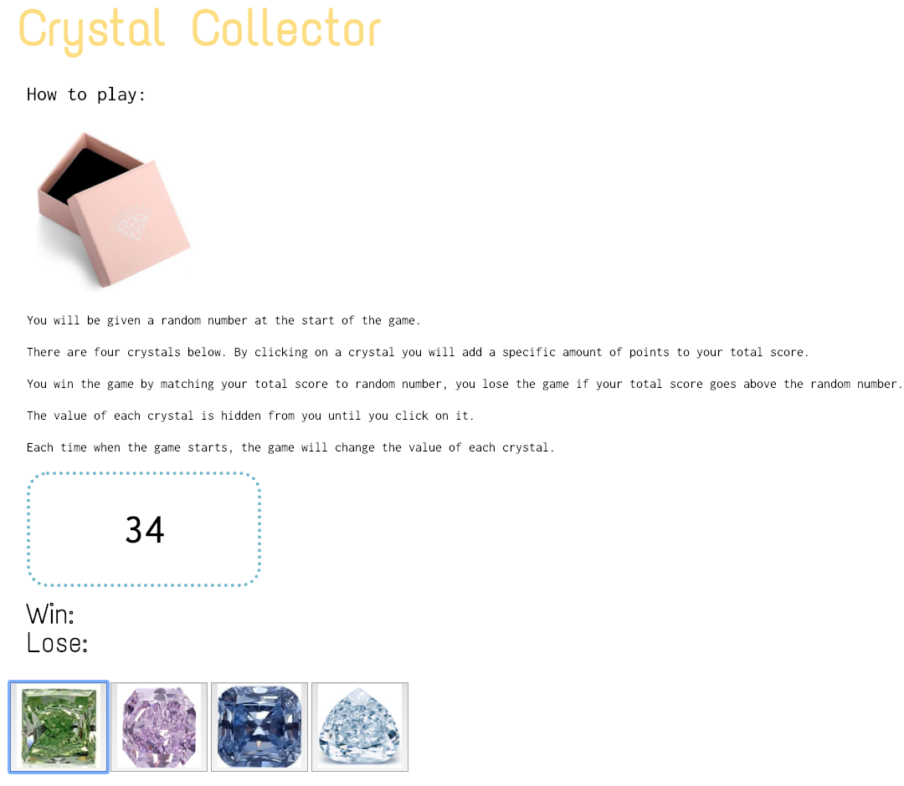

# Crystal Collector
https://ersjava.github.io/unit-4-game1/

An interactive web browsers game that dynamically updates the HTML with the jQuery library.

## How It Works

* The player will be given a random number at the start of the game.

* There are four crystals displayed as buttons on the page.

* The value of each crystal is hidden from until it is clicked.

* By clicking on a crystal a specific amount of points will add to the total score.

* The player wins the game by matching the total score to random number, 

* The player loses the game if the total score goes above the random number.

* The game restarts whenever the player wins or loses and the value of each crystal will change.

## Project Details

### Technologies Used
* jQuery
* CSS
* HTML5

## Contributing
Pull request are welcome!

1. Friend photo is not displaying on the results page. `data.photolink` doesn't seem to grab the data for this value. 

